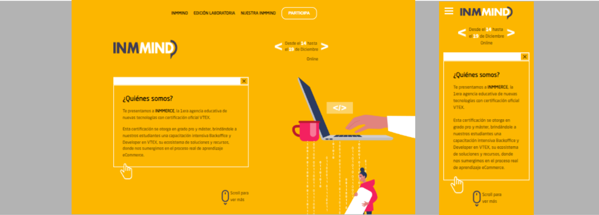

# **Projeto INMMIND**


## Sobre o projeto

Projeto: [trabalho de react js]()

Site desenvolvido em React a partir do projeto realizado por mim em HTML 5 e CSS 3 para a Empresa Commente-me. Fiz um clone para o atual React para demonstrar o uso de suas funcionalidades. Usei componentes funcionais e Hooks, como o useEffect e useRef.

Website developed in React based on a project I carried out in HTML and CSS for the Company Commente-me. I made a clone for the current React to demonstrate the use of its features. I used functional components and Hooks, such as useEffect and useRef.

## Layout web e mobile 



## Tecnologias Utilizadas

* HTML 5
* CSS 3
* Flexbox
* React

## Ferramenta de desenvolvimento

<p float="left">
    
</p>

## Instalação do projeto

##### Instalação de dependências via terminal (Installing dependencies via terminal)
```
    npm install
```

## Execução do projeto

##### Iniciar o projeto (Start the project)
```
    npm start
```

## Autor

#### **Katarine Albuquerque**

<p float="left">
    <a href="https://www.linkedin.com/in/katarine-albuquerque/" target="_blank">
        
    </a>
    &nbsp;
    <a href="mailto:kba.2879@gmail.com" target="_blank">
        
    </a>
</p>
